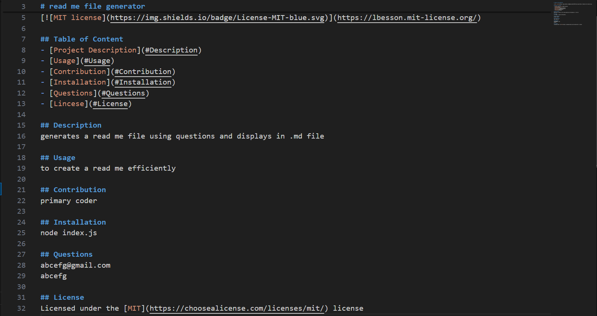

# readme-file-generator

create an app on CLI to write a professional README file.

# User Story

-to create a reuseable template so anyone can write a professional README.
-to ask questions on the command line and type answers
-to show license badge and link to the license file

# Run Command
-navigate to terminal and use the command: node index.js

# GitHub Link:
https://github.com/eramsk/readme-file-generator.git

# Screenshot:

